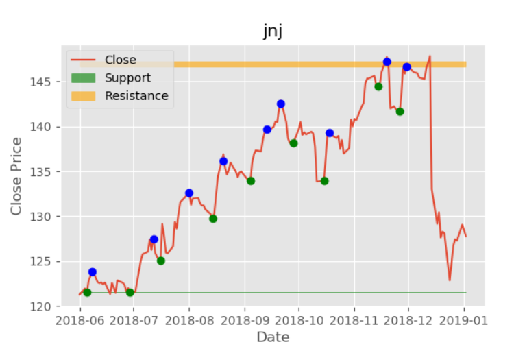
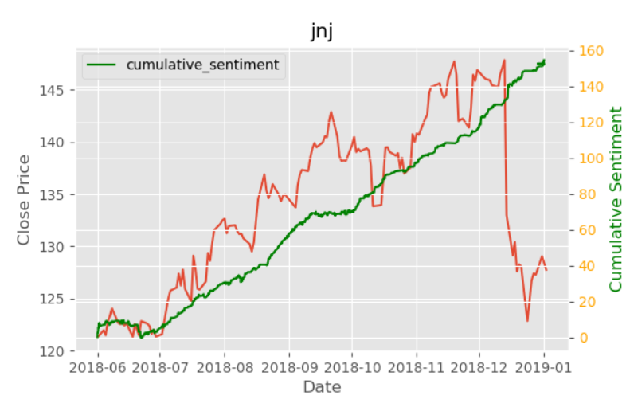
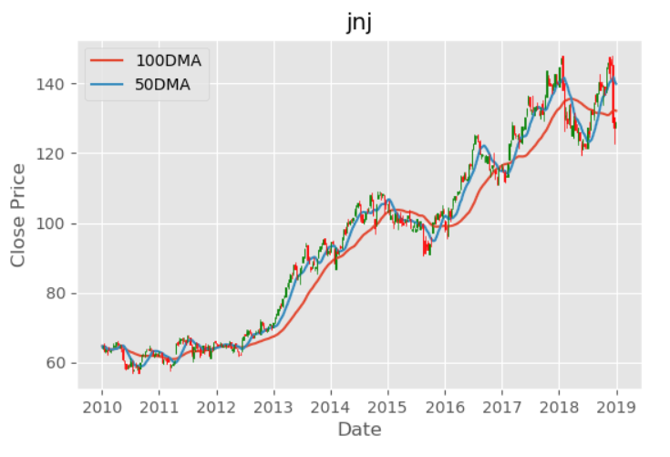
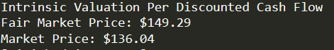

# Jack-Of-All-Trades
Analysis program written in Python that consolidates 3 pillars of investment analysis; sentiment, technical and fundamental. This script takes a stock ticker, performs a discounted cash flow valuation, identifies support and resistance levels alongside entry and exit points. This leads to a final sentiment vs price analysis conducted with data from twitter.

  
   

   
  

## Inspiration ##
Coding and finance are my two passions. However, I feel as if there is gap between the two disciplines which I think should not exist.
Finance and computer science should compliment each other, which is why, I made this proof of concept which combines machine learning and data science with finance.

## Discounted Cash Flow ##
I myself do not believe in valuation techniques. I think they rely on fundamental finance too heavily. Nonetheless, they built the foundation for further innovating, which Is why I chose to include the discounted cash flow model to arrive at an intrinsic valuation for a given ticker.

A discounted cash flow does what it implies. It estimates a companies future cash flows, and discounts these cash flows at some rate to arrive at the intrinsic value of the company.
This model is widely used in the industry, which is why I thought of automating it :).

This DCF model is broken into these 3 parts
* Forecasting Free Cash Flows (FCF)
  

* Weighted Average Cost of Capital (WACC)
  

* Terminal and Intricsic Value
  

## Technical Analysis ##
Technical analysis is a methodology I firmly believe in. It allows us to determine patterns not usually found through financial analysis.

This portion of the program is split into determining the following
* Entry/Exit Points to Determine Support and Resistance Regios

## Sentiment Analysis ##
This was the most skeptical portion of the concept for me. I just started out with machine learning, especially with natural language processing. It's all a blur to me at the moment but I decided to give TextBlob a try.
I scrape tweets from twitter corresponding to a specific stock ticker and plot the sentiment and price correlation.
* Determining Sentiment

* Relating Sentiment and Price

### Dependencies/Libraries Used ###
1. Pandas
2. Numpy
3. MatPlotLib
4. GOT3
5. TextBlob
6. Requests
7. BeautifulSoup
